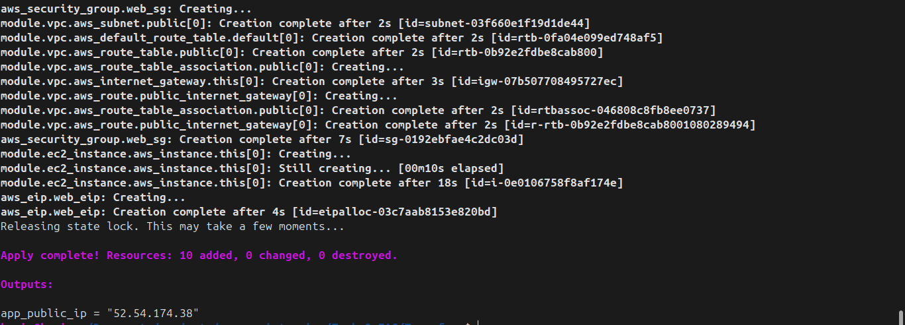
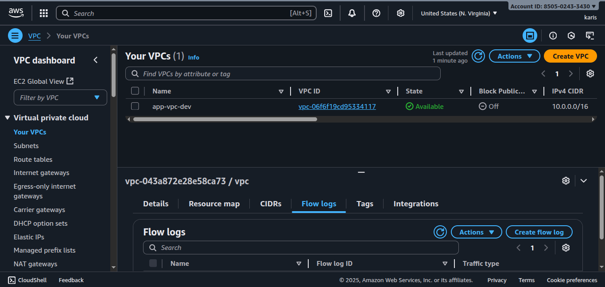
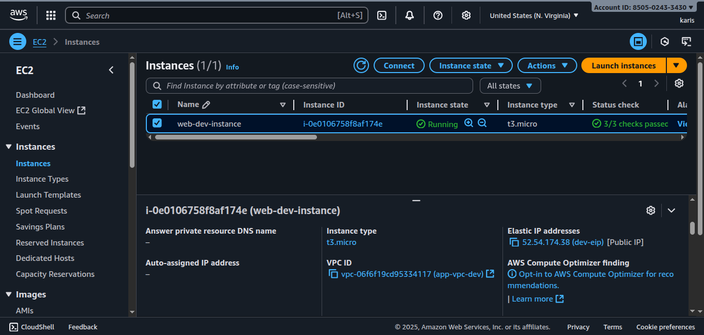

# Task 3: Infrastructure as Code (IaC) – AWS Deployment

## Objective

In this task, we provision AWS cloud resources using **Terraform** to deploy:

- A **VPC** with public subnets
- An **EC2 virtual machine** instance
- Security groups allowing **HTTP, HTTPS, and SSH** traffic
- A **static IP (Elastic IP)** associated with the instance

We also use a **remote backend (S3 + DynamoDB)** for storing Terraform state, ensuring state locking and consistency across environments.

---

## Remote State Backend

A dedicated Terraform configuration is used for the backend:

- **S3 bucket** for storing state
- **DynamoDB table** for state locking

This file must be applied first before any infrastructure deployment.
It outputs the created `bucket_id` for reference.

---

## Workspaces for Environments

We use **Terraform workspaces** to manage multiple environments (`dev`, `stage`, `prod`) with the same codebase.

Commands:

```bash
# Create and switch to a new workspace
terraform workspace new dev
terraform workspace select dev

# To list available workspaces
terraform workspace list
```

Each workspace uses the same code but with different variable values, passed through `terraform.tfvars` files (e.g., `dev.tfvars`, `stage.tfvars`, `prod.tfvars`).
**Remember to add your own tfvars file** with values such as `aws_account_id`, `region`, and `ENV_PREFIX`.

---

## Infrastructure Code

The main Terraform configuration makes use of:

- **Terraform AWS Modules** for VPC and EC2
- Custom **security group** rules for ports 80, 443, and 22
- An **Elastic IP** resource for static IP assignment

This ensures modularity, correctness, and proper handling of dependencies.

---

## Commands to Deploy

1. **Initialize Terraform**

```bash
terraform init
```

2. **Select workspace** (e.g., dev)

```bash
terraform workspace select dev
```

3. **Plan resources**

```bash
terraform plan -var-file="dev.tfvars"
```

4. **Apply resources**

```bash
terraform apply -var-file="dev.tfvars" -auto-approve
```

---

## Outputs

After apply, Terraform will output the **public IP** of the EC2 instance:

```hcl
app_public_ip = "x.x.x.x"
```

---

## Screenshots






